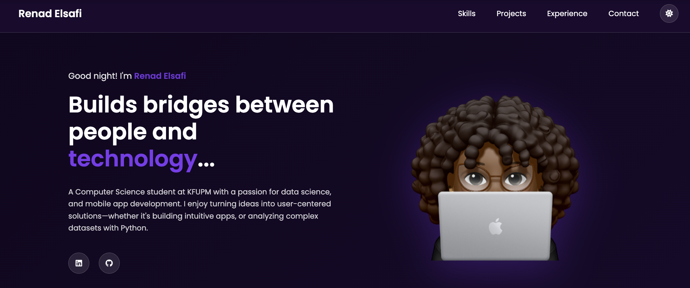

# Renad Elsafi Portfolio



## About This Project

This is the **final version** of my personal portfolio web application — a major evolution from Assignment 1 & 2.  
It’s a **fully responsive**, **highly interactive**, and **AI-enhanced** portfolio that showcases my skills, projects, experience, and personality through modern web technologies and creative animations.

The site now features **real-time API integrations**, **advanced state management**, **multi-theme support**, and delightful micro-interactions that make every visit unique.

### Main Sections

* **Hero** – Personalized time-based greeting + visitor name memory
* **Skills** – Infinite scrolling skill carousel with hover effects
* **Projects** – Filterable & sortable project cards with category tags
* **Experience** – Professional internship showcase
* **GitHub** – Live latest repositories fetched from GitHub API
* **Contact** – Smart contact form with **AI message enhancement** (Professional/Friendly/Concise/Grammar fix)
* **Daily Inspiration** – Random motivational quote (technology-focused) with refresh button
* **Visitor Stats** – Live time-on-site counter + visit count (saved in Local Storage)

---

## Features Implemented

### 1. Dynamic & Interactive Content

* **Personalized Time-Based Greeting** – Changes automatically (“Good morning/afternoon/evening/night”) and remembers your name!
* **3-Theme Switcher** – Purple (default), Light, and Dark modes with smooth transitions and **Local Storage** persistence
* **Visitor Statistics Panel** – Floating widget showing time spent on site + total visits
* **Smooth Scrolling & Active Nav Highlighting**
* **Project Filtering & Sorting** – Filter by category (Web, OOP, Software Eng) and sort by date/name
* **Infinite Skills Carousel** – Pauses on hover, fully responsive

### 2. API Integrations

* **GitHub Repositories** – Dynamically fetches and displays your 6 latest repos with language, stars, forks, and “time ago” formatting
* **Inspirational Quotes API** – Fetches a new tech/motivational quote on load and on button click

### 3. AI-Powered Contact Form

* **AI Message Enhancer** – Click “Enhance with AI” → choose:
  - Make Professional
  - Make Friendly
  - Make Concise
  - Fix Grammar
* Real-time suggestion preview with Accept/Reject buttons
* Character counter (max 1000) + full form validation

### 4. Animations & Micro-interactions

* Floating character animation in Hero & Contact
* Card hover effects with pulsing decorative dots
* Fade-in on scroll for projects/experience
* Typing + gradient glow effect on Skills title
* Theme toggle button with rotation animation
* Spinners, loading states, and success feedback everywhere

### 5. Data Handling & Persistence

* Local Storage used for:
  - Selected theme
  - Visitor name
  - Visit count
  - Time tracking

### 6. Error Handling & UX

* Graceful fallbacks for failed API calls (GitHub/Quotes)
* “No projects found” message when filters return empty
* Form validation with clear error messages
* Loading spinners and retry buttons

### 7. AI Integration Summary

| **AI Tool**      | **Purpose**                                      | **Result/Improvement**                                    |
|------------------|--------------------------------------------------|------------------------------------------------------------|
| **Claude**       | CSS architecture, animations, responsive design | Cleaner code, better performance, smoother animations     |
| **ChatGPT**      | JavaScript logic | Robust features (theme system, filters, visitor stats)    |
| **ChatGPT**      | Debugging & optimization                         | Fixed edge cases, improved Local Storage handling         |
| **ChatGPT**      | Documentation & README writing                  | Clear, professional, and up-to-date documentation        |

→ Full AI usage log available in [docs/ai-usage-report.md](docs/ai-usage-report.md)

---

## Technologies Used

* **HTML5** – Semantic structure
* **CSS3** – Custom properties, gradients, animations, responsive design
* **Vanilla JavaScript (ES6+)** – Classes, async/await, DOM manipulation
* **Font Awesome & Devicon** – Icons
* **Google Fonts (Poppins)** – Typography
* **GitHub API + Quotable API** – Live data
* **Local Storage** – Persistent user preferences
* **Figma** – Initial design & prototyping

---

## How to Run Locally

```bash
git clone https://github.com/reyyynad/Renad_Elsafi_Portfolio.git
cd Renad_Elsafi_Portfolio
```

Then simply open `index.html` in your browser or use Live Server.

---

## Live Demo

Live Site: [https://reyyynad.github.io/Renad_Elsafi_Portfolio/](https://reyyynad.github.io/Renad_Elsafi_Portfolio/)

Fully responsive on mobile, tablet, and desktop!

---

## Documentation

* `docs/ai-usage-report.md` – Detailed prompt history and AI contributions
* `docs/technical-documentation.md` – Code structure, class breakdown, and performance notes

---

## Learning Outcomes

This project pushed my skills in:
* Advanced vanilla JS (OOP with classes, modular code)
* Working with external APIs and handling async data
* Creating polished, production-like UI/UX
* Thoughtful use of AI as a coding partner (not a crutch)
* Building a personal brand through design and interaction

---

## License

Developed by **Renad Elsafi** for educational and portfolio purposes.  
© 2025 Renad Elsafi – All rights reserved.

---
